- [Gitの初期設定〜GitHubへのプルリクエスト（PR）まで](#gitの初期設定githubへのプルリクエストprまで)
  - [GitHubのアカウント作成](#githubのアカウント作成)
  - [Gitの初期設定](#gitの初期設定)
  - [GitHub個人アクセストークンの作成](#github個人アクセストークンの作成)
  - [GitHubのリポジトリ作成](#githubのリポジトリ作成)
  - [GitHubリポジトリのクローン](#githubリポジトリのクローン)
  - [作業用ブランチの作成と現在ブランチの切替](#作業用ブランチの作成と現在ブランチの切替)
  - [ファイルの作成・変更](#ファイルの作成変更)
  - [ファイルのステージング(add)](#ファイルのステージングadd)
  - [コミット](#コミット)
  - [プッシュ](#プッシュ)
  - [プルリクエスト（PR）](#プルリクエストpr)
  - [プルリクエスト（PR）のマージ（ブランチ統合）](#プルリクエストprのマージブランチ統合)
  - [mainブランチでのマージ結果の確認](#mainブランチでのマージ結果の確認)
  - [不要になったブランチの削除](#不要になったブランチの削除)
  - [おわりに](#おわりに)


# Gitの初期設定〜GitHubへのプルリクエスト（PR）まで

- このドキュメントでは、GitとGitHubを使った変更管理の操作を説明します。
- 操作しながらGitやGitHubの理解を深めてもらうのが目的なので、読むだけでなく、実際に操作を行ってみてください。
- 途中ローカルPCという表記がありますが、Cloud9を使っている方はCloud9と読み替えていただいて結構です。

## GitHubのアカウント作成

ｰ [公式サイト](https://docs.github.com/ja/get-started/signing-up-for-github/signing-up-for-a-new-github-account)や他のサイトを見ながら、GitHubアカウントを作成してください。
- 次の手順で個人メールアドレスを公開したくない場合、受信専用のメールアドレス入手をわすれずに。（授業で説明済）

## Gitの初期設定

- コミット履歴に残るあなたの名称、連絡先等の初期設定を行ってください。
- 設定については授業スライドで説明済です。

## GitHub個人アクセストークンの作成

- [公式サイト](https://docs.github.com/ja/github/authenticating-to-github/keeping-your-account-and-data-secure/creating-a-personal-access-token)や他のサイトを見ながら、GitHub個人アクセストークンを作成してください。
- 有効期限は無期限で構いませんが、無くしたり盗まれたりしないようにしてください。
- 読み取り権限は最初から含まれていますが、書き込み権限は明示的に与える必要があります。忘れるとこの後pushで躓くので注意しましょう。

## GitHubのリポジトリ作成

- リポジトリを作成してください。
- README.mdファイルを同時に作成する方法で実施してください。
  - もし忘れた場合は、ブランクコミット（空コミット）が必要なはずです。ブランクコミットの方法は調べて実施してください。

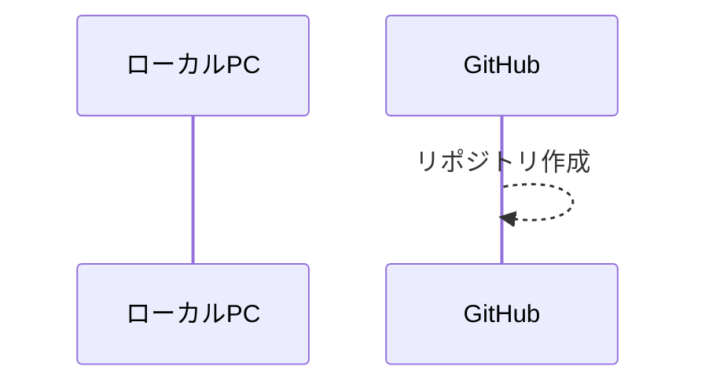

## GitHubリポジトリのクローン

- ローカルPCにリポジトリをクローンしてください。
- リポジトリのURLは、GitHubのリポジトリ画面の「Code」ボタンを押下すると表示されます。
- クローンの方法は、授業スライドで説明済です。
- クローン後、リポジトリのディレクトリに移動してください。

```sh
$ git clone https://???
$ cd ???
```

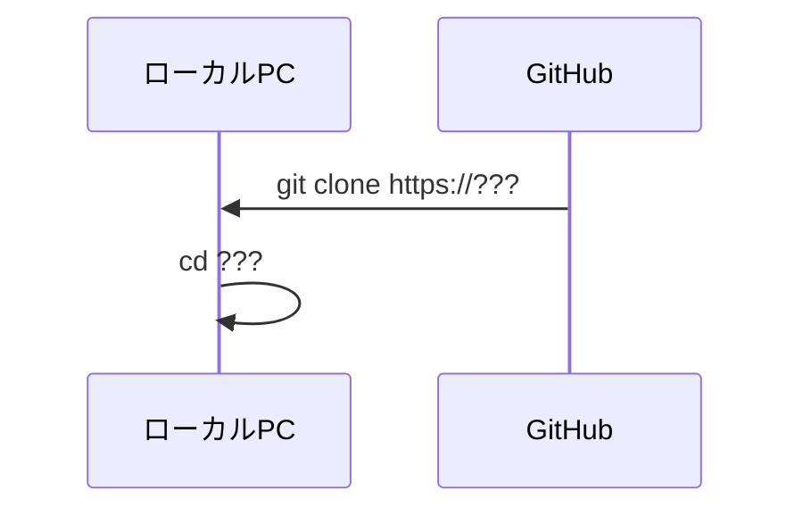

## 作業用ブランチの作成と現在ブランチの切替

- `git-lecture`という名前の作業用ブランチを作成し、`main`から`git-lecture`へ切替（移動）をしてください。一度にやることもできれば、作成と切替を別々にやることもできます。
- gitはいくつかのalternativeなコマンドがあります。以下のコマンドはすべて同じ結果になります。覚えやすいものを使ってください。
  - `git checkout -b git-lecture`
  - `git switch -c git-lecture`

```sh
$ git checkout -b git-lecture

# 以下のコマンドでもOKです。
$ git switch -c git-lecture
```

現在の状態は以下のようになります。

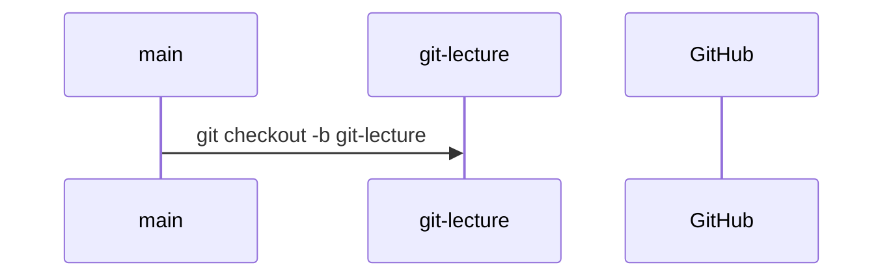

## ファイルの作成・変更

- `git-lecture.md`の名前でMarkdownファイルを作ってください。
- 中身は自由で構いませんが、空にはしないでください。

```sh
$ touch git-lecture.md
```

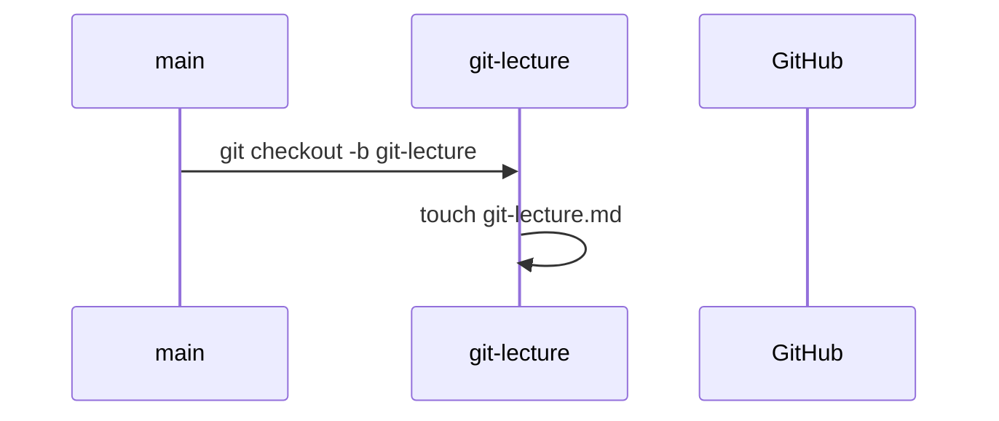


## ファイルのステージング(add)

- `git-lecture.md`をステージングしてください。
- ステージングは、`git add`コマンドで行います。

```sh
$ git add git-lecture.md
```

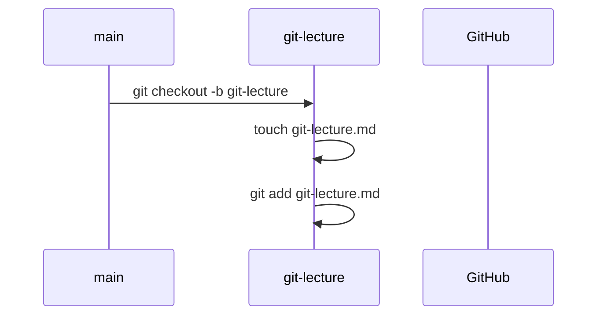

## コミット

- `git-lecture.md`をコミットしてください。
- コミットは、`git commit`コマンドで行います。

```sh
$ git commit -m "add git-lecture.md"
```

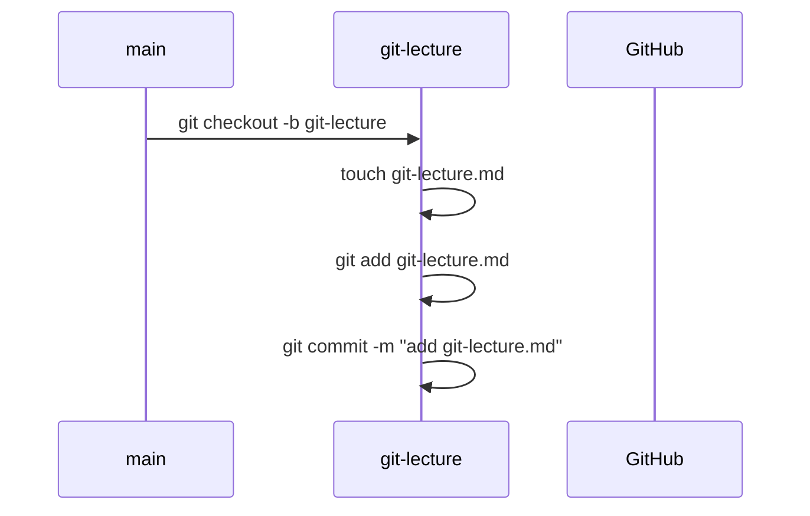

## プッシュ

- `git-lecture.md`をリモートリポジトリ（GitHub）へプッシュしてください。
- プッシュは、`git push`コマンドで行います。

```sh
$ git push origin git-lecture
```

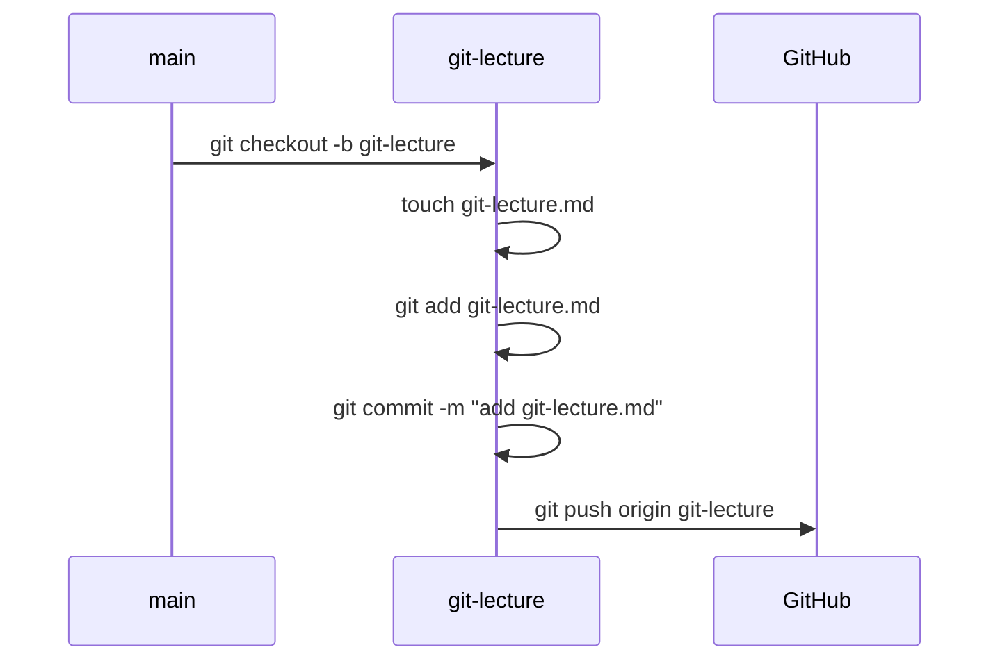

## プルリクエスト（PR）

- GitHubのリポジトリ画面を確認すると、新しいブランチがプッシュされたことを検知していますので、プルリクエスト（PR）を作成してください。
- タイトルと本文は自由に書いて構いませんが、プルリクエストの目的は人にレビューをしてもらうことです。レビューしてほしいポイントや、あなたがやったことを簡潔に書くのが良いでしょう。
- `File changed`タブをクリックすると、変更内容が表示されます。今回は`git-lecture.md`の追加が示されているはずです。
  - 実際のレビューはこの画面を見て行いますので、レビューしてほしいファイルが不足していないか、内容が正しいかを毎回確認してください。

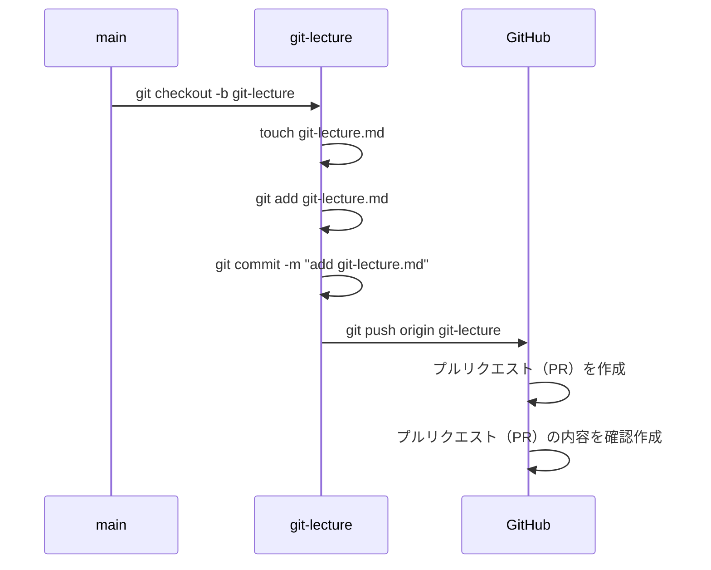

## プルリクエスト（PR）のマージ（ブランチ統合）

- 今回はレビュアーが居ませんので、そのままマージしてもらってOKです。
- マージも1つのコミット操作になるので、コメントが求められます。自動で埋まっているはずですが、内容を変更したければ変更してもらって構いません。

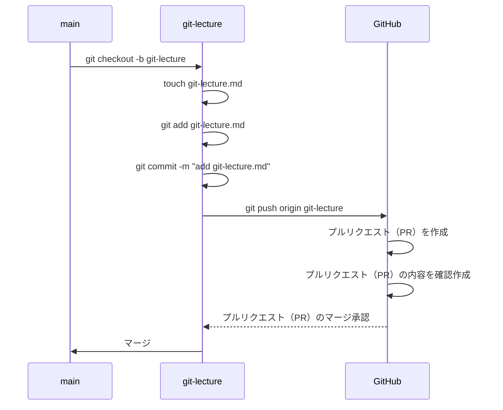

## mainブランチでのマージ結果の確認

- マージが完了すると、GitHubのリポジトリ画面の`main`ブランチでは`git-lecture.md`が追加されているはずです。
- だだし、ローカルPCにはまだ`main`ブランチの変更が反映されていません。
- これを反映させるには、ブランチを`main`に切り替えて、`git pull`コマンドを使います。
- `git-lecture.md`が存在することを確認してください。

```sh
$ git checkout main
$ git pull
$ ls
$ cat git-lecture.md
```

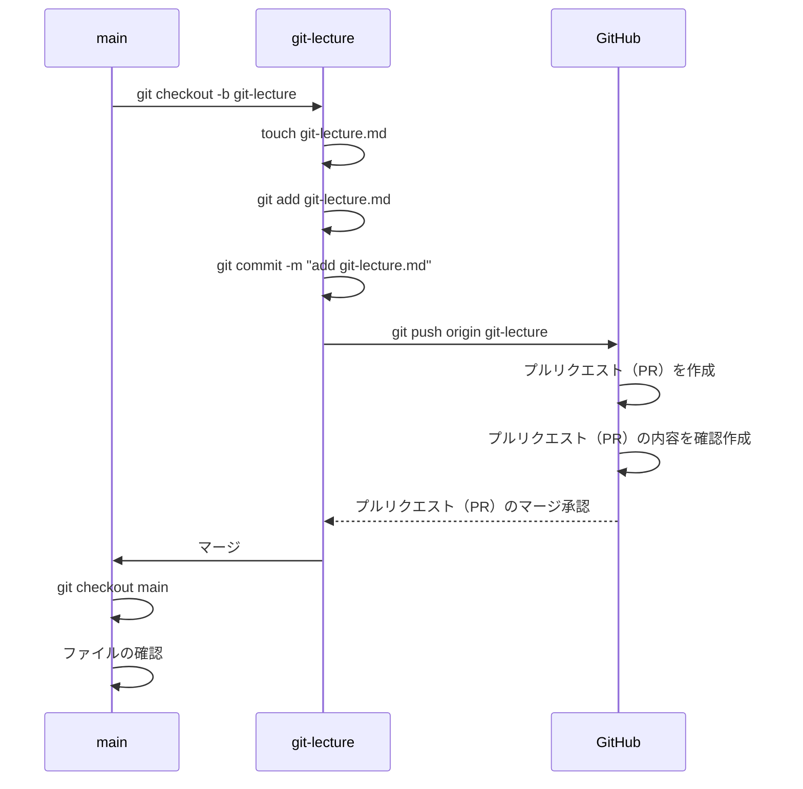

## 不要になったブランチの削除

- 作業用のブランチは自動で消えません。
- `git-lecture`ブランチを削除してください。
- ブランチの削除は、`git branch -d`コマンドで行います。

```sh
$ git branch -d git-lecture
```

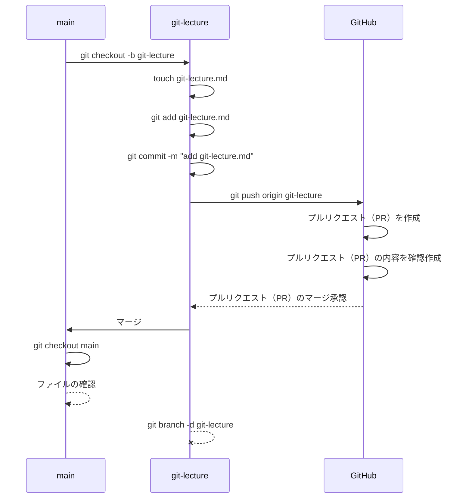


## おわりに

- 以上が、GitとGitHubを使った変更管理の操作のすべてです。
- これらの操作を繰り返すことで、変更履歴を残しながら、複数人での開発を行うことができます。
- この後は実際に課題をやってみてください。やることは変わらないはずです。
