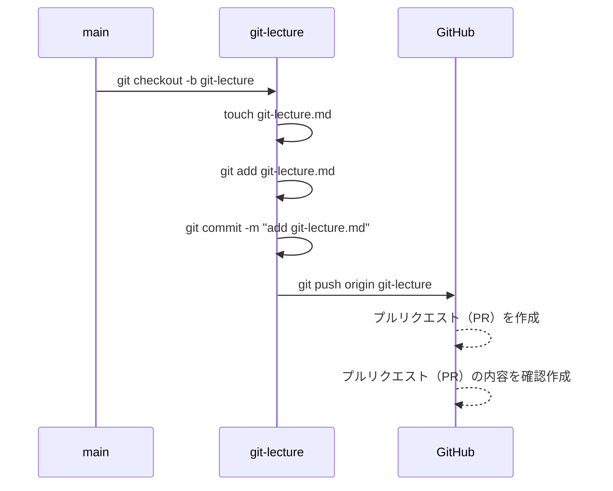
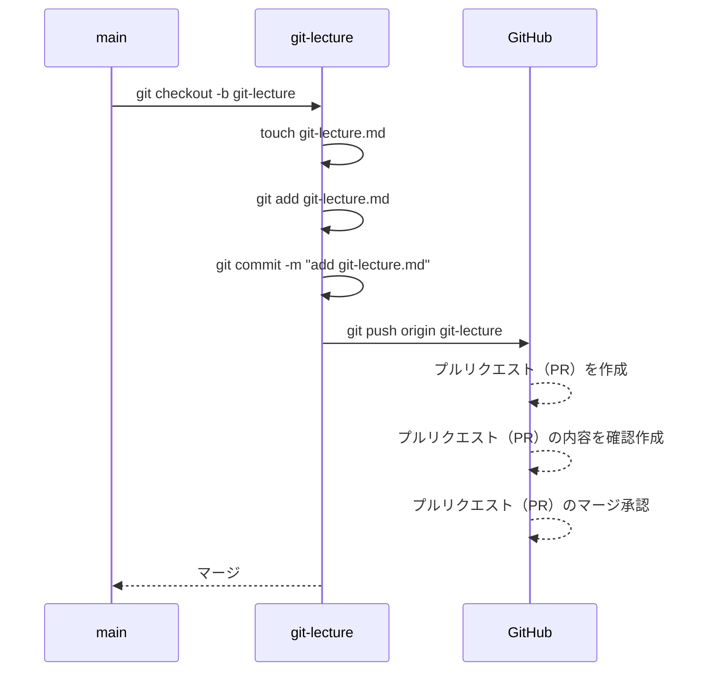
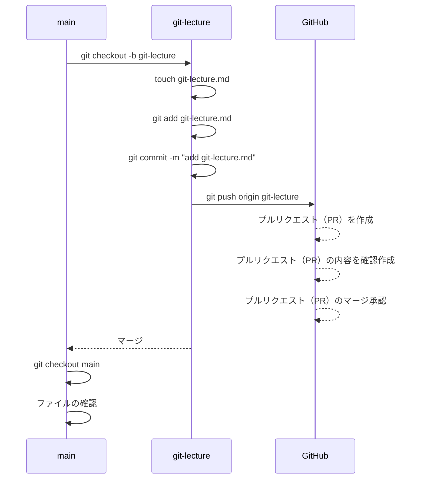
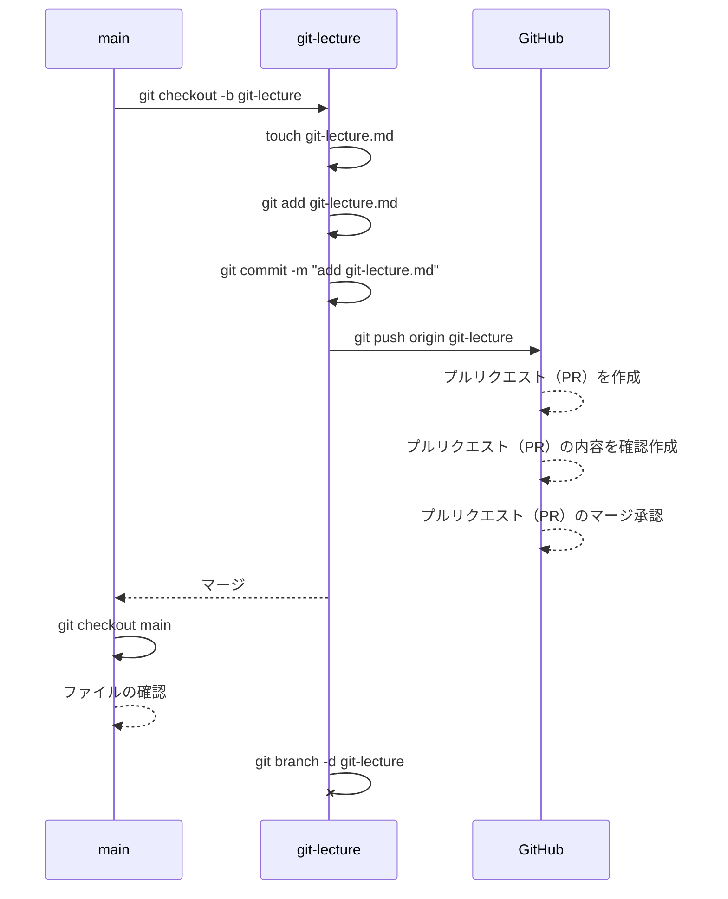

- [Git の初期設定〜GitHub へのプルリクエスト（PR）まで](#git-の初期設定github-へのプルリクエストprまで)
  - [はじめに：かならず読んでください](#はじめにかならず読んでください)
  - [1. GitHub のアカウント作成](#1-github-のアカウント作成)
  - [2. Git の初期設定](#2-git-の初期設定)
  - [3. GitHub 個人アクセストークンの作成](#3-github-個人アクセストークンの作成)
  - [4. GitHub のリポジトリ作成](#4-github-のリポジトリ作成)
  - [5. GitHub リポジトリのクローン](#5-github-リポジトリのクローン)
  - [6. 作業用ブランチの作成と現在ブランチの切替](#6-作業用ブランチの作成と現在ブランチの切替)
  - [7. ファイルの作成・変更](#7-ファイルの作成変更)
  - [8. ファイルのステージング(add)](#8-ファイルのステージングadd)
  - [9. ファイルのコミット](#9-ファイルのコミット)
  - [10. ステージング情報のプッシュ](#10-ステージング情報のプッシュ)
  - [11. プルリクエスト（PR）](#11-プルリクエストpr)
  - [プルリクエスト（PR）のマージ（ブランチ統合）](#プルリクエストprのマージブランチ統合)
  - [main ブランチでのマージ結果の確認](#main-ブランチでのマージ結果の確認)
  - [不要になったブランチの削除](#不要になったブランチの削除)
  - [おわりに](#おわりに)

# Git の初期設定〜GitHub へのプルリクエスト（PR）まで

## はじめに：かならず読んでください

- このドキュメントでは、Git と GitHub を使った変更管理の操作を説明します。
- 操作しながら Git や GitHub の理解を深めてもらうのが目的なので、**読むだけでなく、実際に操作を行って**ください。
- Git や GitHub の操作はなるべく詳しく書いていますが、それ以外の説明、手順は省略していますので、ご自身で調べてください。
- コマンドやフロー図を都度掲載していますので、今どこまで進んでいるかの参考にしてください。
- 途中、「ローカル PC」という表記がありますが、Cloud9 を使っている方は Cloud9 と読み替えていただいて結構です。

## 1. GitHub のアカウント作成

- [公式サイト](https://docs.github.com/ja/get-started/signing-up-for-github/signing-up-for-a-new-github-account)や他のサイトを見ながら、GitHub アカウントを作成してください。
- 次の手順で個人メールアドレスを公開したくない場合、受信専用のメールアドレス入手をわすれずに。（授業で説明済）

## 2. Git の初期設定

- コミット履歴に残るあなたの名称、連絡先等の初期設定を行ってください。
- 設定については授業スライドで説明済です。

## 3. GitHub 個人アクセストークンの作成

- [公式サイト](https://docs.github.com/ja/github/authenticating-to-github/keeping-your-account-and-data-secure/creating-a-personal-access-token)や他のサイトを見ながら、GitHub 個人アクセストークンを作成してください。
- 有効期限は無期限で構いませんが、無くしたり盗まれたりしないようにしてください。
- 読み取り権限は最初から含まれていますが、書き込み権限は明示的に与える必要があります。忘れるとこの後 push で躓くので注意しましょう。

## 4. GitHub のリポジトリ作成

- リポジトリを作成してください。
- README.md ファイルを同時に作成する方法で実施してください。
  - もし忘れた場合は、ブランクコミット（空コミット）が必要なはずです。ブランクコミットの方法は調べて実施してください。


## 5. GitHub リポジトリのクローン

- ローカル PC にリポジトリをクローンしてください。
- リポジトリの URL は、GitHub のリポジトリ画面の「Code」ボタンを押下すると表示されます。
- クローンの方法は、授業スライドで説明済です。
- クローン後、リポジトリのディレクトリに移動してください。

```sh
$ git clone https://???
$ cd ???
```


## 6. 作業用ブランチの作成と現在ブランチの切替

- `git-lecture`という名前の作業用ブランチを作成し、`main`から`git-lecture`へ切替（移動）をしてください。一度にやることもできれば、作成と切替を別々にやることもできます。
- git はいくつかの alternative（同じ意味を持つ）なコマンドがあります。以下のコマンドはすべて同じ結果になります。覚えやすいものを使ってください。
  - `git checkout -b git-lecture`
  - `git switch -c git-lecture`

```sh
$ git checkout -b git-lecture

# 以下のコマンドでもOKです。
$ git switch -c git-lecture
```

現在の状態は以下のようになります。


## 7. ファイルの作成・変更

- `git-lecture.md`の名前で Markdown ファイルを作ってください。
- 中身は自由で構いませんが、空にはしないでください。
- ファイルの作成は、ターミナルなら`touch`コマンドで行えます。エディター上のファイルツリー画面などを使ってもらっても結構です。
- 変更の保存忘れには注意しましょう。

```sh
$ touch git-lecture.md
```


## 8. ファイルのステージング(add)

- `git-lecture.md`をステージングしてください。
- ステージングは、`git add`コマンドで行います。

```sh
$ git add git-lecture.md

# すべてのファイルをステージングする場合は、以下のコマンドでもOKです。
$ git add .
```


## 9. ファイルのコミット

- `git-lecture.md`をコミットしてください。
- コミットは、`git commit`コマンドで行います。

```sh
$ git commit -m "add git-lecture.md"
```


## 10. ステージング情報のプッシュ

- `git-lecture.md`をリモートリポジトリ（GitHub）へプッシュしてください。
- プッシュは、`git push`コマンドで行います。

```sh
$ git push origin git-lecture

# （参考）git pushまでしか入力せずに実行すると、指定が必要な元先のブランチ名称を教えてくれます
$ git push
```


## 11. プルリクエスト（PR）

- GitHub のリポジトリ画面を確認すると、新しいブランチがプッシュされたことを検知していますので、プルリクエスト（PR）を作成してください。
- タイトルと本文は自由に書いて構いませんが、プルリクエストの目的は「人にレビューをしてもらう」ことです。レビューしてほしいポイントや、あなたがやったことを簡潔に書くのが良いでしょう。
- `File changed`タブをクリックすると、変更内容が表示されます。今回は`git-lecture.md`の追加が示されているはずです。
  - 実際のレビューはこの画面を見て行いますので、レビューしてほしいファイルが不足していないか、内容が正しいかを毎回確認してください。



## プルリクエスト（PR）のマージ（ブランチ統合）

- 今回はレビュアーが居ませんので、そのままマージしてもらって OK です。
- マージも 1 つのコミット操作になるので、コメントが求められます。自動で埋まっているはずですが、内容を変更したければ変更してもらって構いません。



## main ブランチでのマージ結果の確認

- マージが完了すると、GitHub のリポジトリ画面の`main`ブランチでは`git-lecture.md`が追加されているはずです。
- だだし、ローカル PC にはまだ`main`ブランチの変更が反映されていません。
- これを反映させるには、ブランチを`main`に切り替えて、`git pull`コマンドを使います。
- `git-lecture.md`が存在することを確認してください。

```sh
$ git checkout main
$ git pull
$ ls
$ cat git-lecture.md
```



## 不要になったブランチの削除

- 作業用のブランチは自動で消えません。
- `git-lecture`ブランチを削除してください。
- ブランチの削除は、`git branch -d`コマンドで行います。

```sh
$ git branch -d git-lecture
```



## おわりに

- 以上が、Git と GitHub を使った変更管理の操作のすべてです。
- これらの操作を繰り返すことで、変更履歴を残しながら、複数人での開発を行うことができます。
- この後は実際に課題をやってみてください。やることは変わらないはずです。
